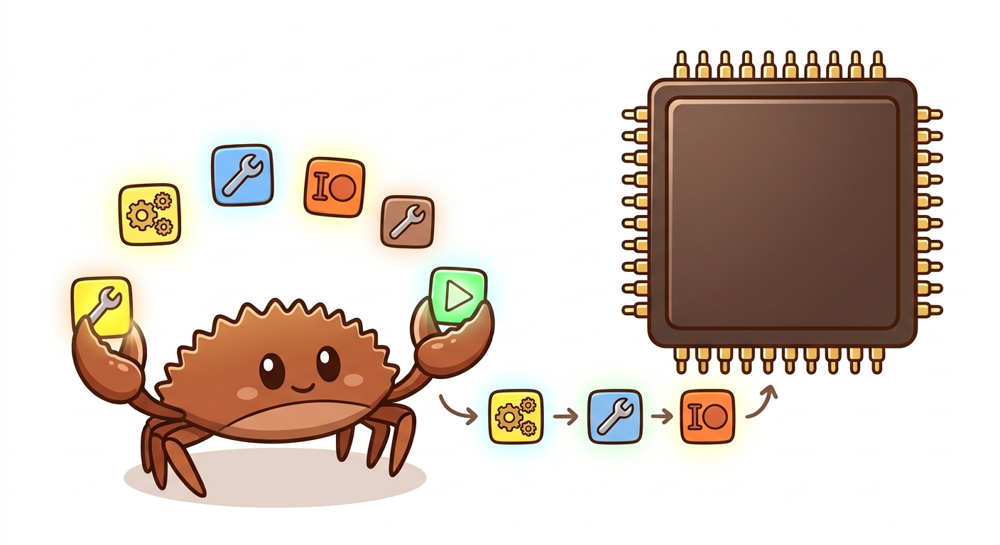
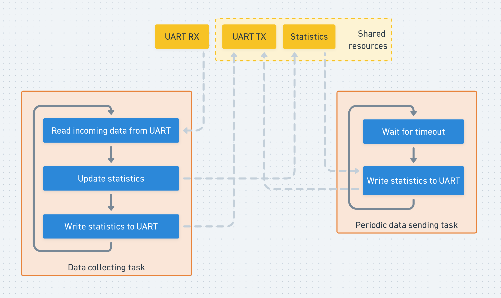
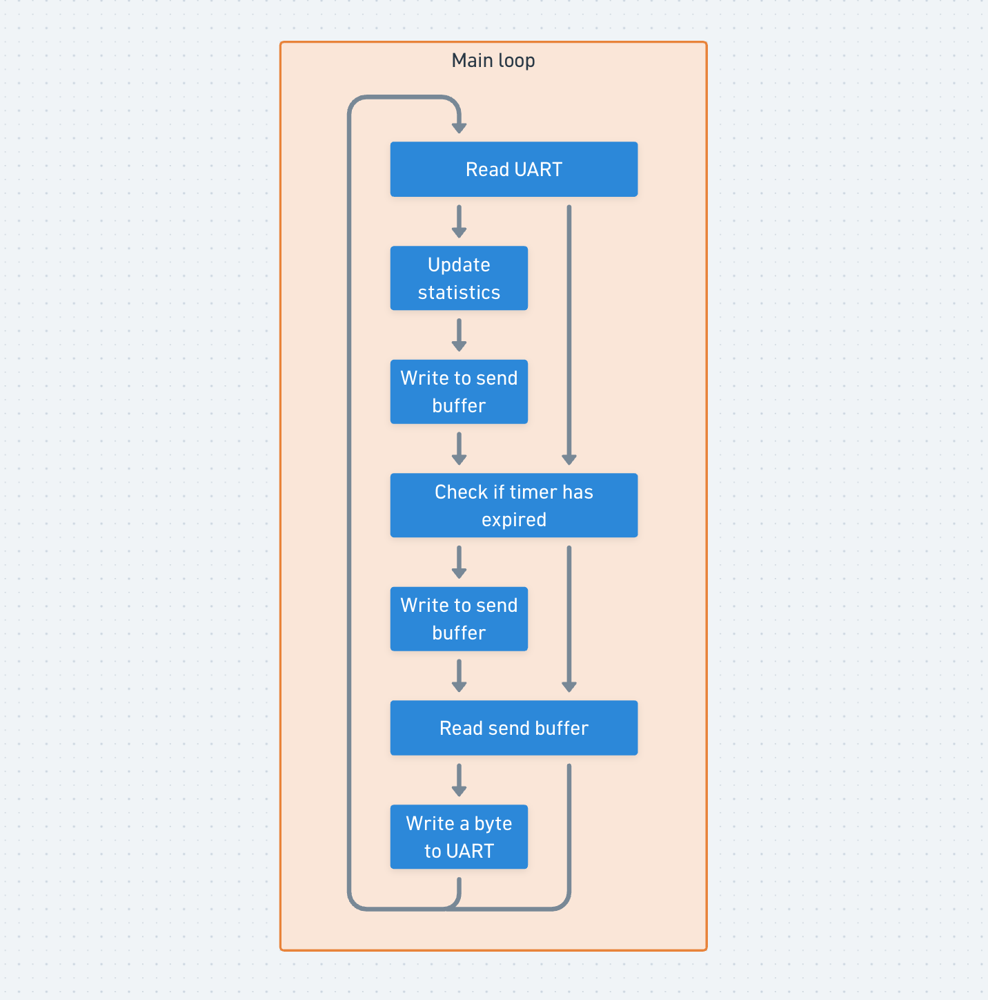
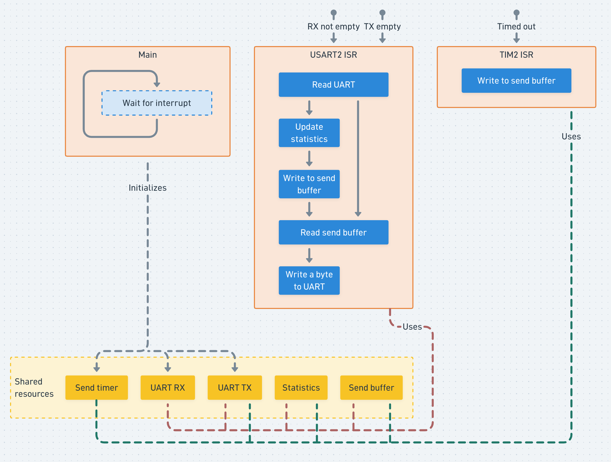
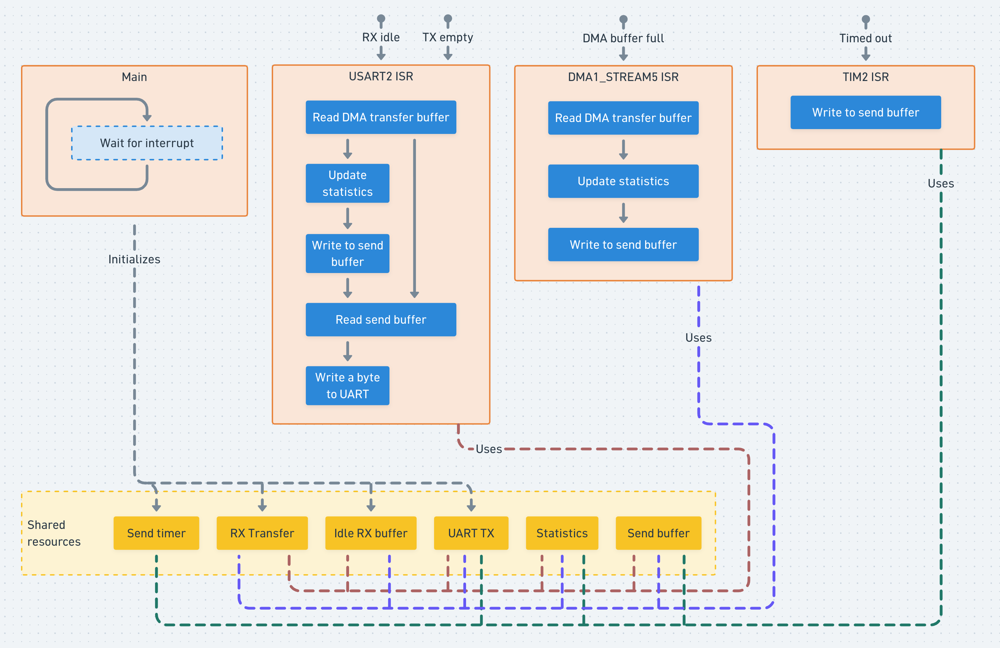

# Simple or Efficient? Why Not Both: Multitasking in Embedded Rust with Embassy



Developing an embedded system always involves trade-offs: cost vs. performance, complexity vs. maintainability, and so on. In this post, we'll explore the balance between code simplicity and execution efficiency in multitasking. More importantly, we'll look at an approach that eliminates that trade-off - giving you code that is both simple and efficient.

## Our Toy Example
Input-output (I/O) is an important part of embedded systems. Often the whole purpose of a system is to connect data sources to data sinks, with little to no computation in between - I/O is the only responsibility. Let's walk through a simple I/O example that's very common in embedded development: say we have an STM32F4 microcontroller, and we want to read data sent via UART at a cadence set by the sender (e.g., a sensor read), aggregate it into in-memory data structures, and send aggregated statistics out over UART whenever the statistics change or on a fixed time interval. It's a fairly simple setup, but sufficient to illustrate our ideas without adding unnecessary complications.

With this example, we can discuss how to implement mostly independent tasks, how to access shared resources from both tasks and interrupt service routines (ISR), and - more importantly - how to keep the code simple.
How can we accomplish this? Let's start with the simplest approach, though not the most effective one.

### 1. Simple as Hell - Polling and Super Loop
We just try to read, process if there is new data, and repeat.
Let's see a code example (shortened for brevity, [full example code](https://github.com/sulevsky/multitasking-in-embedded-rust-with-embassy/blob/main/stm32f4xx-hal-examples/examples/polling.rs)).

```rust
const SEND_PERIOD: Duration<u32, 1, 1000> = fugit::MillisDurationU32::millis(1000);

fn main() -> ! {
    info!("POLLING EXAMPLE");
    info!("Starting initialization");
    let dp = stm32f4xx_hal::pac::Peripherals::take().unwrap();
    let mut rcc = dp.RCC.constrain();
    let gpioa = dp.GPIOA.split(&mut rcc);

    info!("Initializing USART2");
    let (mut uart_tx, mut uart_rx) = dp
        .USART2
        .serial::<u8>(
            (gpioa.pa2, gpioa.pa3),
            stm32f4xx_hal::serial::Config::default(),
            &mut rcc,
        )
        .unwrap()
        .split();

    let mut timer = dp.TIM2.counter_ms(&mut rcc);
    timer.start(u32::MAX.micros()).unwrap();

    let mut statistics = Statistics::new();
    let mut send_buffer = Buffer::<128>::new();
    info!("Started data collection");
    let mut next_send = timer.now() + SEND_PERIOD;
    loop {
        match uart_rx.read() {
            Ok(byte) => {
                statistics.update_statistics(byte);
                if send_buffer.is_read_finished() {
                    writeln!(send_buffer, "{}", statistics).unwrap();
                }
            }
            Err(stm32f4xx_hal::nb::Error::Other(error)) => {
                error!("UART error: {:?}", defmt::Debug2Format(&error));
            }
            Err(stm32f4xx_hal::nb::Error::WouldBlock) => {
                // requires blocking to complete
            }
        }

        let now = timer.now();
        if now > next_send {
            if send_buffer.is_read_finished() {
                writeln!(send_buffer, "{}", statistics).unwrap();
            }
            next_send += SEND_PERIOD;
        }
        if !send_buffer.is_read_finished() {
            if let Some(item) = send_buffer.read_next() {
                match uart_tx.write(item) {
                    Ok(_) => send_buffer.mark_byte_as_read(),
                    Err(stm32f4xx_hal::nb::Error::Other(error)) => {
                        error!("UART error: {:?}", defmt::Debug2Format(&error));
                    }
                    Err(stm32f4xx_hal::nb::Error::WouldBlock) => {
                        // requires blocking to complete
                    }
                }
            }
        }
    }
}
```
The idea of a polling loop seems simple, but as functionality grows, its downsides start to show. Even in this simple example, we have multiple state checks, flags, and conditions. And all the code is coupled in the main loop.

The main advantage of this approach is non-blocking I/O: if the sending or receiving line is busy, the code just moves on to the next iteration instead of waiting.
However, it introduces several key drawbacks:
1. Low cohesion: unrelated tasks, like collecting data and sending statistics, live in the same place.
2. Temporal coupling: if we add more and more tasks that take CPU time, we risk preventing the data sending task from meeting its periodic execution requirement. Another temporal problem: if the loop doesn't complete a full iteration in time, the data collecting task will simply miss the data.
3. Power inefficiency: our CPU sits in a busy loop, consuming energy while doing nothing useful.

### 2. Blocking I/O - Simple, but Can't Solve Our Problems
The polling example seems to have added a lot of accidental complexity - for a simple task, we've ended up with a lot of state management. What we really want is a small number of sequential operations that clearly describe the problem we're solving.
Something like this:
```rust
loop {
    let read_byte = embedded_hal_nb::nb::block!(uart_rx.read()).unwrap();
    statistics.update_statistics(read_byte);
    writeln!(uart_tx, "{}", statistics).unwrap();

    // can't place data sending task here!
}
```
Three lines match the operations from the image describing the data receiving task. Under the hood, `embedded_hal_nb::nb::block!` polls in a loop until there is data in the UART. So with this example we can't integrate a periodic data sending task into the loop - blocking I/O delays the data-sending task, which we need to run once per second.

On the other hand, if we look at the data-sending task, the problem we're solving is just in 2 lines:
```rust
loop {
    delay_ms(1000);
    writeln!(uart_tx, "{}", statistics).unwrap();

    // can't place data receiving task here!
}
```
But here we have the same problem `delay_ms(1000)` blocks execution, so any data sent via UART during this block will be lost.
But I have some arguments for this type of code. Please don't throw tomatoes yet!


Of course, if there are independent tasks, like in our example, using blocking operations is a catastrophe. But if tasks depend on each other (e.g., a simple REPL: read input -> parse -> process -> print), does it make sense to treat parsing as a separate task, or make reading non-blocking when every other step logically depends on the one before it? In this case, blocking I/O seems reasonable: the code is simpler and straightforward. In fact, we're mostly reasoning about code execution as a sequence of blocking operations. What we're really valuing here isn't blocking itself - it's **sequential** code: each step is written to depend cleanly on the one before it. Blocking is just the simplest mechanism to do it. The question is whether we can keep the sequential code even when we have multiple tasks, without paying for it with a busy CPU - which is exactly where we're headed.

Here's one more example of sequential-but-blocking code: have you ever wondered why they say that the `sleep()` function is an antipattern? I don't mean the technical reasons why - I mean, why it's so often said that this is an antipattern? If it's so bad, why are programmers still using it? And the answer is that it's simple and easy. Simple to reason about, easy to use for common tasks like pausing or running periodically. I wonder: what if we could use it without downsides?

Alright, let's move on to more mature approaches and try to solve the busy loop problem. 

### 3. Interrupts - No Blocking and No Busy Loop
The first idea for getting rid of polling and blocking is to use interrupts: let our peripherals notify us when data is available.
We'll put our receiving and sending logic inside ISRs. These ISRs are lightweight enough - no heavy computations, no blocking operations inside. Even though this isn't a problem here, the better general practice would be to keep ISRs small and have them only signal that an event occurred via a flag, leaving the main loop to check that flag and process the event accordingly. That would make the main-loop code look similar to the polling example, just polling flag state instead of UART and timer state. For illustration purposes, though, we'll keep the logic directly in ISRs - not best practice, but easier for understanding the code structure.
[Full example code](https://github.com/sulevsky/multitasking-in-embedded-rust-with-embassy/blob/main/stm32f4xx-hal-examples/examples/interrupt.rs).
Our interrupt example has three key sections of code.
1. `main` function - responsible for setting up the application. Because we decided to put the tasks' logic in the ISRs, the main loop doesn't have anything to do, so it becomes:
```rust
loop {
    asm::wfi();
}
``` 
This assembly instruction puts the CPU into sleep mode until an interrupt arrives, so it won't run inefficient busy loops - that's the main benefit of this approach.
During setup, we configure USART2, make the UART receiver handler listen for `RXNE` (Read Data Register Not Empty) events. We also configure the timer. And in the interrupt controller, we unmask `USART2` and `TIM2` to enable the respective interrupts.
2. `TIM2` ISR - reacts to the timer: clears the timer interrupt flag, transfers current statistics to `SEND_BUFFER`.
3. `USART2` ISR - responsible for interactions with UART, both sending and receiving. Since this ISR is triggered by two events we're listening for (data available in RX - `RXNE` and TX is available for sending - `TXE`, Transmit Data Register Empty), both event-processing paths have to live inside a single function. In the receiving part of the function, we check whether a new byte has arrived (no blocking), update statistics, and write it into the send buffer. In the sending part of the function, we check whether the transmitter is available and whether data is waiting in the buffer, then send a single byte.

The interrupt approach seems to have a similar amount of code coordination compared to the polling approach. But here we have an additional topic to discuss - shared resources. 



Let's pick the UART TX handler of type `stm32f4xx_hal::serial::Tx<stm32f4xx_hal::pac::USART2>` as an example - it has to be shared between three independent execution paths, very similar to three threads sharing a resource. To make it available to all functions, we create a static variable. We have to initialize the static variable, but we can configure it only in `main`, so we wrap the handler in an `Option`,initializing it with `None` at declaration.
One more thing: we can't safely share this handle across interrupt contexts without a guarantee that there won't be race conditions - that's what the Rust compiler enforces. So we wrap the TX handler in a `Mutex` (to guarantee exclusive access) and in a `RefCell` (to allow interior mutability).

Putting this together, here's what it takes to interact with UART TX from interrupt handlers in Rust. Note that the snippets are simplified and error handling is left out - otherwise supporting code would bury the point: 
1. declaration in the static block
```rust
static UART_TX: Mutex<RefCell<Option<stm32f4xx_hal::serial::Tx<stm32f4xx_hal::pac::USART2>>>> =
    Mutex::new(RefCell::new(None));
```
2. `main` function - initializes and updates the static variable with `Some(uart_tx)`.
```rust
let (uart_tx, mut uart_rx) = dp
    .USART2
    .serial::<u8>(
        (gpioa.pa2, gpioa.pa3),
        stm32f4xx_hal::serial::Config::default(),
        &mut rcc,
    )
    .unwrap()
    .split();
cortex_m::interrupt::free(|cs| {
    UART_TX.borrow(cs).replace(Some(uart_tx));
});
```
3. `TIM2` ISR - enables listening for TXE events after a timeout
```rust
cortex_m::interrupt::free(|cs| {
    UART_TX.borrow(cs).borrow_mut().as_mut().unwrap().listen();
});
```
4. `USART2` ISR 
   - enables listening for TXE events when statistics have been updated
```rust
cortex_m::interrupt::free(|cs| {
    UART_TX.borrow(cs).borrow_mut().as_mut().unwrap().listen();
});
```
   - writes to UART if the buffer has data to send
```rust
cortex_m::interrupt::free(|cs| {
    UART_TX.borrow(cs).borrow_mut().as_mut().unwrap().write(byte).unwrap();
});
```
   - disables listening for TXE events when the buffer is emptied
```rust
cortex_m::interrupt::free(|cs| {
    UART_TX.borrow(cs).borrow_mut().as_mut().unwrap().unlisten();
});
```

It's quite a complex setup for the UART TX handler, and we have to do a similar setup for all shared resources:
- UART_RX
- UART_TX
- STATISTICS
- SEND_TIMER
- SEND_BUFFER
That seems like a lot of preparation. And if I try to find business logic (the five lines from the blocking example) in there, it won't be easy. 
Let's summarize pros and cons for the interrupt approach.
Cons:
- Setup is complex
- Business logic is scattered in many places
- Synchronization is required 
Pros:
- No blocking, tasks are independent
- More energy efficient
Energy efficiency came at the cost of simplicity. And we didn't even get the full efficiency we paid for: `USART2` ISR fires on every byte received. If a lot of bytes are coming in, that's a lot of ISR invocations - and each one requires a context switch, which costs energy. Part of the efficiency gain we just made is getting spent right back on interrupt overhead. Let's see if DMA can fix that.

### 4. Interrupts with DMA
Now let's move from plain interrupt handling to DMA - the interrupt in the previous example was responsible for moving each byte from UART into memory; here DMA takes over that job. The timer configuration is unchanged, so I won't repeat it. What's new is the UART setup and the added DMA configuration.
[Full example code](https://github.com/sulevsky/multitasking-in-embedded-rust-with-embassy/blob/main/stm32f4xx-hal-examples/examples/dma.rs).
DMA acts as an intermediary between UART and memory: it reads incoming bytes and writes them into a buffer. When the buffer fills, an interrupt fires and the `DMA1_STREAM5` ISR runs. That ISR does two things:
1. Manage the DMA buffers - swap to the other buffer (this is the ping-pong pattern), read out the one just filled, clear it, and store it in a static variable for the next swap.
2. Update statistics with the newly received data and write the result into the send buffer.
 
The `DMA1_STREAM5` ISR is only invoked when the buffer is full. But if the UART receives a batch of bytes that doesn't happen to fill the buffer, the `DMA1_STREAM5` ISR won't be triggered, and the data would sit unprocessed. To catch this case, we bring back our good friend, the `USART2` ISR - but this time it's not triggered on every byte. Instead, it's triggered by the `IDLE` interrupt, which fires when the UART goes quiet for the duration of one frame, signaling that the sender has paused. Inside that `USART2` ISR, we do almost the same work as in the `DMA1_STREAM5` ISR, except we only read the portion of the buffer that was actually filled.
Just like with the interrupts-only approach, DMA brings its own set of shared resources to coordinate.

Let's review this approach. It's quite efficient - the CPU does nothing when there's nothing to do, and DMA handles the transfer work, relieving the CPU even further. The ISR now fires only when the buffer is full or a transmission has finished - not on every byte.
Whew! That sounds pretty good. We should be proud of ourselves. 
But what are the pros and cons?
Cons:
- Setup is even more complex
- Business logic is scattered across even more places
- More shared resources require synchronization

Pros:
- No blocking, tasks remain independent
- Even more energy efficient than the interrupt-only approach

Here's where we need to pause. We've landed on a configuration that's optimal from an efficiency standpoint, but we had to walk a long road to get there. And that's exactly the problem: people reach for the optimal approach only when it's easy or when the requirements leave no other option. It's the same reason we so often see the `sleep()` function in code, even though everyone agrees it's not best practice: it's just easy.

## Combining Simplicity and Efficiency with Embassy
The simplicity of sequential, blocking-style code. The efficiency of DMA and interrupts. Is there a way to get both?
Enter the Embassy - it's a framework for building embedded applications in Rust. Personally, I started learning it because of its async approach to concurrency, but as I dug in, more and more features made me fall in love with the framework. Let's walk through some of them using our example.
### Async/Await
Dealing with I/O required complex state management from us. We can hand that responsibility to a special component of the Embassy framework - the executor. When the executor hits a blocking operation inside the async function, it can take other tasks or put the CPU in the sleep mode. For developers, though, all of this is abstracted away - the code just looks like a simple function call.
For example, in this snippet, we're reading from the UART to a memory buffer:
```rust
let mut buffer = [0u8; 512];
let num_bytes_read = uart_rx.read_until_idle(&mut buffer).await.unwrap();    
```
### Tasks
Like in many RTOSes, execution in Embassy is organized in tasks, which are just async functions with the `#[embassy_executor::task]` macro.
```rust
#[embassy_executor::task]
async fn task_name() {
    // task's code
}
```
We define three Embassy tasks as async functions. What's good about these functions? First, there's a clear separation of concerns: tasks are isolated, and code is not intertwined, unlike in the polling and interrupt examples. Second, peripheral handlers are passed in as parameters, so we no longer need to wrap the UART RX handler in a `Mutex`, `RefCell`, and `Option` - we only need to wrap things that are actually shared between tasks, which in our case are just aggregated statistics and the UART TX handler.

For our example, we will have 3 tasks:
```rust
#[embassy_executor::task]
async fn collect_statistics(mut uart_rx: UartRx<'static, Async>) {
    let mut buffer = [0u8; 512];
    loop {
        let num_bytes_read = uart_rx.read_until_idle(&mut buffer).await.unwrap();
        for i in 0..num_bytes_read {
            STATISTICS.lock().await.update_statistics(buffer[i]);
        }
        STATISTICS_UPDATED.signal(());
        buffer.fill(0);
    }
}

#[embassy_executor::task]
async fn send_statistics_on_update() {
    loop {
        STATISTICS_UPDATED.wait().await;
        send_statistics().await;
    }
}

#[embassy_executor::task]
async fn send_statistics_periodically() {
    loop {
        Timer::after(SEND_PERIOD).await;
        send_statistics().await;
    }
}
```
### Main function
The `main` function has changed: now it's async and marked with `#[embassy_executor::main]` macro, so the Embassy executor takes over running and managing the runtime. `main` also accepts a `Spawner` as a parameter, letting us spawn new tasks. In the body, we configure peripherals and spawn the tasks - and that's all: a single-responsibility application bootstrap.
```rust
static STATISTICS: Mutex<CriticalSectionRawMutex, Statistics> = Mutex::new(Statistics::new());
static UART_TX: Mutex<CriticalSectionRawMutex, Option<UartTx<'static, Async>>> = Mutex::new(None);
static STATISTICS_UPDATED: Signal<CriticalSectionRawMutex, ()> = Signal::new();

#[embassy_executor::main]
async fn main(spawner: Spawner) {
    let p = embassy_stm32::init(Default::default());
    let (uart_tx, uart_rx) = embassy_stm32::usart::Uart::new(
        p.USART2,
        p.PA3,
        p.PA2,
        p.DMA1_CH6,
        p.DMA1_CH5,
        Irqs,
        embassy_stm32::usart::Config::default(),
    )
    .unwrap()
    .split();
    UART_TX.lock().await.replace(uart_tx);
    spawner.spawn(collect_statistics(uart_rx).unwrap());
    spawner.spawn(send_statistics_periodically().unwrap());
    spawner.spawn(send_statistics_on_update().unwrap());
}
```
I liked how `WFI` instruction in the main loop kept the CPU from doing pointless work. But even more, I like that now there is no loop in the main at all - the function just does its work and returns. Nonetheless, the loop hasn't disappeared; it's just hidden inside the executor now.

### DMA
In previous examples, we saw that DMA configuration is complex, and that's what repels developers from using it. With embassy, enabling DMA for USART is just two additional parameters:
```rust
let (uart_tx, uart_rx) = embassy_stm32::usart::Uart::new(
    p.USART2,
    p.PA3,
    p.PA2,
    p.DMA1_CH6, // <--- DMA configuration for the UART TX
    p.DMA1_CH5, // <--- DMA configuration for the UART RX
    Irqs,
    embassy_stm32::usart::Config::default(),
)
.unwrap()
.split();
```
Interrupts configuration with `bind_interrupts!` macro, which checks the bindings at compile time:
```rust
bind_interrupts!(
    struct Irqs {
        USART2 => usart::InterruptHandler<peripherals::USART2>;
        DMA1_STREAM5 => dma::InterruptHandler<peripherals::DMA1_CH5>;
        DMA1_STREAM6 => dma::InterruptHandler<peripherals::DMA1_CH6>;
    }
);
```
If I forget to bind `DMA1_STREAM5 => dma::InterruptHandler<peripherals::DMA1_CH5>`, I get a compile-time error instead of failure in production.
```
the trait bound `Irqs: Binding<DMA1_STREAM5, InterruptHandler<DMA1_CH5>>` is not satisfied
```
That's a meaningful advantage of Rust in embedded development - bugs like this get caught before they ever ship. [More on how Rust helps catch bugs early](https://medium.com/@sulevsky/testing-embedded-applications-with-rust-from-unit-tests-to-hardware-in-the-loop-b0df253f0789)
So with Embassy, using DMA is both simple and safe - that's a huge selling point. The best practice becomes the easy one to follow.
I'll just drop in a quote from the [Embassy documentation](https://embassy.dev/book/#_what_is_dma:~:text=However%2C%20because%20DMA%20is%20more%20complex%20to%20set%2Dup%2C%20it%20is%20less%20widely%20used%20in%20the%20embedded%20community.%20Embassy%20aims%20to%20change%20that%20by%20making%20DMA%20the%20first%20choice%20rather%20than%20the%20last.): 
> However, because DMA is more complex to set-up, it is less widely used in the embedded community. Embassy aims to change that by making DMA the first choice rather than the last.

With that, let's put it all together and look at the complete solution using Embassy: [Full example code](https://github.com/sulevsky/multitasking-in-embedded-rust-with-embassy/blob/main/embassy-examples/examples/embassy.rs).
Before we summarize our journey, I can already hear some of you asking: "What about RTOS?" Fair question. That's a comparison worth its own article. Stay tuned!

## Summary 
- We took a simple, common task in embedded programming - read data sent via UART, process it, periodically send results - and solved it five different ways to explore the simplicity-vs-efficiency trade-off.
- Polling is the easiest to write, but couples unrelated business logic together and wastes CPU in a busy loop
- Blocking, sequential code is even simpler and matches how we naturally think about the problem - but it could only work for a small number of tasks with very relaxed timing requirements
- Interrupts remove the busy loop and the blocking, but pay for it with logic scattered across ISRs and manual synchronization for every shared resource
- Adding DMA buys more efficiency by reducing the number of ISR invocations - but at a cost of even more setup complexity, making a more optimal approach also less likely to get used
- Embassy's async/await breaks that trade-off entirely: tasks read like simple, sequential code, while the executor handles scheduling and sleeping for us under the hood. Turns out - we can have both.

## Resources
1. [The Rust book on async/await](https://doc.rust-lang.org/book/ch17-00-async-await.html)
2. [Embassy book](https://embassy.dev/book/)
3. [Async Rust in Embedded Systems with Embassy - Great talk from the creator of Embassy](https://www.youtube.com/watch?v=H7NtzyP9q8E)
4. [Source code for this article](https://github.com/sulevsky/multitasking-in-embedded-rust-with-embassy)
